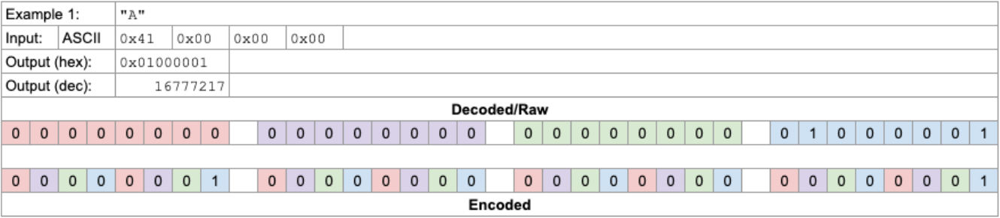

# 8-bit Text Encoder

This is a text encoder that takes a string of arbitrary length, converts it to binary, then encodes it into a an integer.

## How
This script will encode a bundle of characters into a proprietary format.

If the string is less than four characters, it is zero padded.

It is then converted into 8-bit binary data, then encoded and transformed.

Here are examples of strings.

This program will encode a string into a list of integers, and decode a list of integers into a string.